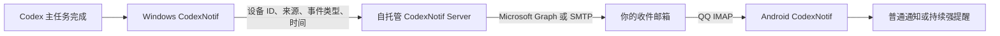

# CodexNotif

CodexNotif 在 Codex 主任务完成、准备等待下一次输入时发送一封简短邮件；Android 手机端通过 QQ 邮箱 IMAP 读取新邮件，再按你配置的规则显示普通通知或持续响铃的强提醒。

它适合这样的场景：任务在电脑上运行，你暂时离开工位，希望手机及时提醒，但又不希望把提示词、代码、对话或生成结果交给一个额外的推送平台。

## 它解决什么问题

- Codex 主任务每次完成一轮并停止等待时，自动提交一个最小化事件。
- Windows 客户端负责 Codex `notify` 配置、邮箱绑定和事件转发。
- 自托管服务端负责验证设备、发送邮件，并可选择 Microsoft Graph OAuth2 或 SMTP。
- Android 客户端监听 QQ IMAP，只读取新邮件的发件人和主题用于规则匹配。
- 每条规则可以选择“普通通知”或“强提醒”；强提醒会持续响铃，直到用户确认。

## 架构与数据流



## 隐私边界

Windows 客户端提交给服务端的事件只有：

- 随机生成的设备 ID；
- 来源 `codex`；
- 事件类型 `agent.completed`；
- 事件发生时间。

它不会提交 Codex 的提示词、回答、对话记录、项目路径、源代码、文件内容或完成结果。服务端生成的通知邮件也只包含上述元数据和“请回到电脑查看结果”的提示。

需要同时了解以下本地数据：

- Windows 客户端把绑定邮箱、设备令牌和配置状态写入当前用户的 `%LOCALAPPDATA%\CodexNotif`。设备令牌是访问凭据，请保护 Windows 账户和该目录。
- 服务端把设备绑定、邮箱地址和加密后的临时令牌写入 H2 数据库；`APP_ENCRYPTION_KEY` 不可丢失，也不可提交到 Git。
- Android 客户端把 QQ 邮箱授权码放在系统安全存储中；后台任务读取新邮件的发件人和主题用于匹配，不读取邮件正文。
- 若启用 Microsoft Graph，Refresh Token 会使用 `APP_ENCRYPTION_KEY` 加密后写入 H2。

## 仓库结构

| 目录 | 内容 |
| --- | --- |
| `desktop/` | .NET 8 WPF Windows 客户端、Codex notify 安装/恢复脚本和自测试 |
| `server/` | Java 17 / Spring Boot 邮件中继服务和宝塔示例配置 |
| `mobile/` | Flutter 客户端，当前重点支持 Android / HyperOS |
| `tools/` | 脱敏审计、铃声生成和依赖许可报告脚本 |
| `docs/` | Flutter 与 Maven 依赖许可明细 |
| `third_party/licenses/` | 构建工具及第三方依赖随附许可文本 |

桌面端仍保留部分历史内部命名空间 `AgentPager`，这不影响最终生成的 `CodexNotif.exe`。

## 环境要求

- Windows 10/11；
- .NET 8 SDK，以及运行桌面端所需的 .NET 8 Desktop Runtime；
- Java 17；
- Maven 3.9 或兼容版本；
- Flutter SDK（项目 Dart 约束见 `mobile/pubspec.yaml`）；
- Android SDK；
- 一台允许 USB 调试或可自行安装 APK 的 Android 手机；
- 一个可发送邮件的 Microsoft 账户或 SMTP 账户；
- Android 端当前按 QQ 邮箱 IMAP 设计，需要在 QQ 邮箱中开启 IMAP 并生成授权码。

下面的命令均从仓库根目录执行。示例域名、邮箱和密钥必须替换为你自己的值，但不要把真实值写回仓库。

## 1. 本地启动服务端

服务端必须配置两个彼此独立的高熵密钥：`APP_ENCRYPTION_KEY` 用于数据库敏感字段加密，`CODEXNOTIF_ACCESS_KEY` 用于拒绝未授权的 API 请求。不要复用二者。

先为服务端与 Windows 客户端生成共同的访问密钥。脚本只把密钥写入当前 Windows 用户环境变量和剪贴板，不会打印或写入仓库：

```powershell
powershell -NoProfile -ExecutionPolicy Bypass -File tools\Set-CodexNotifAccessKey.ps1
$env:CODEXNOTIF_ACCESS_KEY = [Environment]::GetEnvironmentVariable(
  'CODEXNOTIF_ACCESS_KEY',
  'User'
)
```

再单独生成服务端使用的 32 字节 Base64 加密密钥。PowerShell 7 或较新的 .NET 环境可执行：

```powershell
$keyBytes = New-Object byte[] 32
[Security.Cryptography.RandomNumberGenerator]::Fill($keyBytes)
[Convert]::ToBase64String($keyBytes)
```

也可以在安装了 OpenSSL 的环境执行：

```bash
openssl rand -base64 32
```

只做健康检查时，可先让完成事件写入服务端日志：

```powershell
$env:APP_ENCRYPTION_KEY = '<BASE64_32_BYTE_KEY>'
$env:ADMIN_SETUP_TOKEN = '<RANDOM_ADMIN_TOKEN>'
$env:CODEXNOTIF_ACCESS_KEY = '<GENERATED_SECRET>'
$env:NOTIFICATION_MODE = 'log'
$env:SERVER_PORT = '27843'
mvn -f server/app/pom.xml spring-boot:run
```

另开终端检查：

```powershell
$headers = @{
  'X-CodexNotif-Access-Key' = $env:CODEXNOTIF_ACCESS_KEY
}
Invoke-RestMethod http://localhost:27843/health -Headers $headers
```

服务默认只监听 `127.0.0.1:27843`。`27843` 是本公开版的默认端口；可以通过 `SERVER_PORT` 修改，但桌面端、Nginx 和 Microsoft 回调地址必须同步。

## 2. 配置邮件发送

正式绑定邮箱前，必须选择 Microsoft Graph 或 SMTP。`NOTIFICATION_MODE` 应设为 `email`。

### 方案 A：SMTP

```powershell
$env:APP_ENCRYPTION_KEY = '<BASE64_32_BYTE_KEY>'
$env:ADMIN_SETUP_TOKEN = '<RANDOM_ADMIN_TOKEN>'
$env:CODEXNOTIF_ACCESS_KEY = '<GENERATED_SECRET>'
$env:NOTIFICATION_MODE = 'email'
$env:EMAIL_PROVIDER = 'smtp'
$env:SMTP_HOST = 'smtp.example.com'
$env:SMTP_PORT = '587'
$env:SMTP_USERNAME = 'sender@example.com'
$env:SMTP_PASSWORD = '<SMTP_SECRET>'
$env:SMTP_FROM = 'sender@example.com'
$env:SMTP_AUTH = 'true'
$env:SMTP_STARTTLS_ENABLE = 'true'
$env:SMTP_SSL_ENABLE = 'false'
mvn -f server/app/pom.xml spring-boot:run
```

端口 465 通常需要 `SMTP_SSL_ENABLE=true` 且关闭 STARTTLS；端口 587 通常使用 STARTTLS。以邮件服务商文档为准。

### 方案 B：Microsoft Graph OAuth2

完整步骤见后面的“Microsoft Graph OAuth2”。完成 OAuth 连接前，Graph 发送功能不会工作。

## 3. 构建和配置 Windows 客户端

构建并发布框架依赖版本：

```powershell
dotnet build desktop/app/AgentPager.csproj -c Release
dotnet publish desktop/app/AgentPager.csproj -c Release --self-contained false -o desktop/app/bin/Release/net8.0-windows/publish
```

最终程序为 `desktop/app/bin/Release/net8.0-windows/publish/CodexNotif.exe`。Windows 必须使用与服务端完全相同的 `CODEXNOTIF_ACCESS_KEY`。普通用户可以直接配置：

1. 从宝塔复制 `CODEXNOTIF_ACCESS_KEY` 的值；
2. 打开 CodexNotif，在“服务器设置”的遮罩密钥框中粘贴；
3. 点击“保存并测试”。

密钥框永远不会回填真实值；留空表示保留现有密钥。新值会使用 Windows DPAPI（当前用户范围）加密保存到 `%LOCALAPPDATA%\CodexNotif\access-key.dat`，并在系统允许时同步到当前用户环境变量；它不会进入 `%LOCALAPPDATA%\CodexNotif\settings.json`、日志或界面明文。某些电脑的安全策略会拒绝写入用户环境变量，客户端会自动改用 DPAPI 加密存储，无需管理员权限。该加密文件只能由保存它的 Windows 用户在本机解密，因此换电脑或换 Windows 用户后需要重新配置一次。更换已有密钥后应重新打开 Codex，避免已启动的旧进程继续使用旧值。

无人值守或批量部署可以在仓库根目录运行：

```powershell
powershell -NoProfile -ExecutionPolicy Bypass -File tools\Set-CodexNotifAccessKey.ps1
```

脚本会生成密钥、设置当前用户环境变量并复制到剪贴板；把剪贴板内容粘贴到宝塔的同名环境变量。如果密钥先在服务器生成，也可以复制服务器密钥后运行：

```powershell
powershell -NoProfile -ExecutionPolicy Bypass -File tools\Set-CodexNotifAccessKey.ps1 -UseClipboard
```

通过脚本修改环境变量后必须完全退出并重新打开 CodexNotif 和 Codex。日常配置优先使用客户端界面；脚本适合无人值守部署，但可能被电脑的安全策略禁止写入环境变量。

打开程序后，在“服务器设置”中填写完整的 HTTPS 服务地址并点击“保存并测试”；只有 `localhost`、`127.0.0.1`、`::1` 等本机回环地址允许使用 HTTP。地址会保存到当前用户的 `%LOCALAPPDATA%\CodexNotif\settings.json`，桌面界面和后台 Codex 完成通知共用该值。“保存并测试”会同时验证服务器访问密钥；已绑定设备还会验证 Device Token。客户端不会自动跟随服务器重定向，避免把访问密钥带到其他地址。

服务器地址按以下优先级解析：

1. 客户端“服务器设置”中保存的地址；
2. `CODEXNOTIF_SERVER_URL` 环境变量；
3. 内置默认值 `http://localhost:27843`。

无人值守部署也可以设置用户级环境变量，再重新打开程序：

```powershell
[Environment]::SetEnvironmentVariable(
  'CODEXNOTIF_SERVER_URL',
  'https://notify.example.com',
  'User'
)
```

打开 `CodexNotif.exe` 后：

1. 如果界面显示访问密钥未配置，在遮罩密钥框粘贴宝塔中的同名密钥；已配置时留空即可；
2. 在“服务器设置”中填写服务地址，点击“保存并测试”，确认服务器验证通过；密钥输入框随后会自动清空；
3. 填写接收提醒的邮箱；
4. 打开验证邮件中的链接；
5. 回到桌面端等待绑定完成；
6. 点击“启用 Codex 监听”；
7. 同意程序备份并更新当前用户的 `.codex/config.toml`；
8. 完全退出并重新打开 Codex。

“恢复默认”会清除客户端保存的地址，然后重新使用环境变量或内置本机地址。更改服务器地址不会删除已保存的邮箱绑定和 Device Token；如果切换到另一台服务器，应使用“发送测试通知”确认原绑定在新服务器上仍然有效。

程序使用 Codex 原生 `notify` 接收 `agent-turn-complete`。如果原本已有其他 `notify` 命令，安装器会记录并继续转发给原命令。恢复时只在配置仍等于本程序安装内容时操作，避免覆盖用户之后的修改。

也可以在发布完成后运行：

- `desktop/scripts/安装CodexNotif完成通知.cmd`；
- `desktop/scripts/恢复CodexNotif完成通知.cmd`。

脚本只对当前用户配置生效，并使用一次性的 `-ExecutionPolicy Bypass` 启动；不会修改系统级 PowerShell 执行策略。

## 4. 构建和配置手机端

```powershell
cd mobile
flutter pub get
flutter test
flutter analyze
$env:CODEXNOTIF_ANDROID_KEYSTORE='<PATH_OUTSIDE_REPOSITORY>\codexnotif-release.p12'
$env:CODEXNOTIF_ANDROID_STORE_PASSWORD='<SECRET_FROM_PASSWORD_MANAGER>'
$env:CODEXNOTIF_ANDROID_KEY_ALIAS='codexnotif'
$env:CODEXNOTIF_ANDROID_KEY_PASSWORD='<SECRET_FROM_PASSWORD_MANAGER>'
flutter build apk --release
```

四项签名环境变量必须同时存在；缺少任意一项时 Release 构建会直接失败，不会回退到 Android Debug 证书。密钥文件必须放在仓库外并单独备份，密码只保存在密码管理器中。不要把真实路径或密码写入脚本、`key.properties`、README、日志或 Git。

APK 位于 `mobile/build/app/outputs/flutter-apk/app-release.apk`，Android application ID 为 `org.codexnotif.mobile`。`v0.1.0-beta.2` 的 Android 可见版本名也是完整的 `v0.1.0-beta.2`，内部 `versionCode` 为 `2`。

首次设置：

1. 在 QQ 邮箱网页设置中开启 IMAP 服务并生成独立授权码；
2. 在 App 中填写完整 QQ 邮箱地址和授权码，授权码不是 QQ 登录密码；
3. 点击“测试 QQ IMAP 登录”；
4. 如果 QQ 收信规则会把目标邮件移动到自定义文件夹，点击“监听文件夹”选择该文件夹；未设置时监听根收件箱 `INBOX`；
5. 如果列表只显示五个系统文件夹，请先在 QQ 邮箱网页版的“收取选项”中开启“收取我的文件夹”，保存后重新打开选择器；
6. 添加提醒规则。规则从上到下匹配，第一条命中规则决定通知方式和铃声；
7. 在“通知方式”中选择普通通知或强提醒；
8. 普通通知由系统通知渠道处理；强提醒会打开提醒界面并持续响铃，直到确认；
9. 开启后台监听，并检查“IMAP 最近检查”是否持续更新。

开启监听后，App 退到普通后台时会继续检查邮件；从最近任务划掉 App 后会主动停止监听，且不会开机自启、更新后自启或自动复活。需要继续监听时重新打开 App 并启用后台监听。

在小米/HyperOS 的最近任务界面，如果 CodexNotif 名称旁显示锁图标，卡片已被系统锁定，划动不会真正移除任务；先长按卡片并解除锁定，再横向划掉。只按 Home 或切换到其他 App 不会停止监听。

历史测试包使用临时包名和 Android Debug 证书。正式包使用 `org.codexnotif.mobile` 和独立发布证书，两者可以短暂共存但配置不会自动迁移：先安装新版并重新填写 QQ 邮箱授权码和规则，确认正常后卸载旧测试包。

内置铃声由 `tools/generate_tones.py` 生成。选择手机系统铃声时会进入系统铃声页面，选中后可试听；离开选择页或结束试听应立即停止播放。蓝牙路由由 Android、铃声音频用途及厂商策略共同决定，HyperOS 可能仍优先从手机扬声器播放闹钟音频，不能保证所有机型都走蓝牙。

仓库保留 iOS 工程骨架，但当前后台 IMAP、持续强提醒和全屏行为主要按 Android 实现和验证；不要把 iOS 目录视为已达到同等功能。

## 5. 连接 Codex notify

推荐通过桌面端按钮或随附脚本安装。安装后的 `.codex/config.toml` 会包含指向当前 `CodexNotif.exe` 的顶层 `notify` 命令。不要手工复制其他电脑的绝对路径。

Codex 只在主任务一轮完成时调用该命令；子 Agent 的内部结束不会单独发送邮件。通知进程会：

1. 验证事件类型是 `agent-turn-complete`；
2. 向原有 notify 程序转发原始事件（如果存在）；
3. 只构造最小化 `agent.completed` 事件发给 CodexNotif Server；
4. 即使邮件提交失败，也不会阻止 Codex 继续运行。

## 6. 端到端验证

1. 使用带 `X-CodexNotif-Access-Key` 请求头的可信 HTTP 工具访问本机或生产 HTTPS `/health` 并返回正常；
2. Windows 客户端显示服务器正常并完成邮箱绑定；
3. Android App 的 QQ IMAP 测试成功，后台通知栏显示最近检查时间持续更新；
4. 在 Codex 中执行一个很短的任务，等待主任务停止；
5. 服务端日志应记录事件或成功发送邮件；
6. QQ 邮箱收到 `[CodexNotif] Codex 任务已完成`；
7. Android 端第一条匹配规则触发预期的普通通知或强提醒；
8. 强提醒测试结束后点击确认，验证铃声立即停止。

如果邮件已经到达但手机没有提醒，优先检查 IMAP 最近检查、规则顺序、通知权限、全屏权限、电池策略和自启动，而不是重复修改服务端。

## 使用宝塔部署服务端

1. 在本地构建：

   ```bash
   mvn -f server/app/pom.xml clean package
   ```

2. 上传 `server/app/target/codexnotif-server.jar` 到 `<DEPLOY_DIR>`。
3. 在宝塔安装 Java 17，创建 Java 项目，工作目录设为 `<DEPLOY_DIR>`，启动命令为：

   ```bash
   java -jar <DEPLOY_DIR>/codexnotif-server.jar
   ```

4. 从 `server/deploy/baota/环境变量-MicrosoftGraph.example.txt` 或 `环境变量-SMTP备用.example.txt` 复制变量到宝塔项目设置，并替换所有占位符；`CODEXNOTIF_ACCESS_KEY` 必须与 Windows 客户端完全一致。
5. 为站点 `notify.example.com` 申请 HTTPS 证书。
6. 把 `server/deploy/baota/nginx-location.conf` 中的 `location` 配置加入站点。
7. Java 服务只监听 `127.0.0.1:27843`；安全组和防火墙只开放 80/443，不要直接公开 27843。
8. 在服务器本机和外部 HTTPS 分别检查 `/health`，两次请求都必须携带 `X-CodexNotif-Access-Key`；不要把真实密钥写入命令历史或截图。
9. 将 `<DEPLOY_DIR>/data` 仅授权给 Java 项目用户，并定期加密备份 H2 数据库。
10. 在宝塔中设置进程异常重启和开机启动，并监控磁盘、Java 日志和 `/health`。

如果你修改 `SERVER_PORT`，必须同时修改 Nginx `proxy_pass`。生产客户端只应使用 HTTPS 域名，不应直接连接 Java 监听端口。

## Microsoft Graph OAuth2

1. 在 Microsoft Entra 管理中心注册 Web 应用；
2. 添加 Web 重定向 URI：`https://notify.example.com/admin/microsoft/callback`；
3. 添加 Microsoft Graph 委托权限 `Mail.Send`，并按租户策略完成同意；
4. 创建客户端密码；
5. 设置 `EMAIL_PROVIDER=microsoft`、`MICROSOFT_ENABLED=true`、租户、客户端 ID、客户端密码和完全一致的回调 URI；
6. 启动服务后，在受信任浏览器打开：

   ```text
   https://notify.example.com/admin/microsoft/connect?setupToken=<ADMIN_SETUP_TOKEN>
   ```

7. 登录用于发件的 Microsoft 邮箱并授权；页面显示连接成功后，Refresh Token 已加密保存；
8. 使用以下接口发送测试邮件：

   ```text
   POST https://notify.example.com/admin/test-email?setupToken=<ADMIN_SETUP_TOKEN>&to=name@example.com
   ```

`ADMIN_SETUP_TOKEN` 会出现在连接 URL 和可能的代理访问日志中。只在管理时使用，完成配置后应更换令牌并清理相关历史/日志；不要把它发给普通用户。

## SMTP 与可选 Postfix

已有可靠 SMTP 服务时，直接使用 `EMAIL_PROVIDER=smtp`，无需安装 Postfix。

如果你自行维护 Postfix，可让应用连接只在本机可达的 SMTP 监听地址，并按实际策略设置 `SMTP_AUTH`、TLS 和端口。公网发信还需要正确配置：

- SPF；
- DKIM；
- DMARC；
- 发信 IP 的 PTR/rDNS；
- 与 PTR 一致的主机名和 Envelope-From；
- 云服务商允许的出站 25 端口或上游 SMTP relay。

缺少这些配置时，即使 Java 返回发送成功，邮件也可能进入垃圾箱或被收件服务器拒绝。不要把开放中继暴露到公网。

## Android 与 HyperOS 注意事项

小米/HyperOS 对后台进程限制较强。至少检查：

- 通知权限已允许；
- 强提醒所需的全屏通知/在其他应用上显示权限已允许；
- 前台服务常驻通知仍存在；
- 通知栏里的“最近检查”时间持续变化，而不只是显示“监听正常”；
- 系统勿扰、闹钟音量和所选铃声不是静音；
- 若希望继续监听，只把 App 退到后台，不要从最近任务划掉。

`v0.1.0-beta.2` 不申请忽略电池优化，也不申请开机自启动。用户划掉最近任务、强行停止、重启手机或厂商执行深度清理后，监听停止且不会自动恢复；这是降低侵入性和安全软件误报风险的预期行为。

## 常见问题

### 服务健康，但 Windows 客户端连接失败

检查 `CODEXNOTIF_SERVER_URL` 是否包含正确协议且没有额外路径；再确认客户端界面中的访问密钥长度不少于 32 个字符并与服务端完全一致。若电脑拒绝写入用户环境变量，直接在遮罩输入框粘贴密钥并点击“保存并测试”，客户端会自动使用 Windows 当前用户加密存储。通过环境变量修改配置后必须重启客户端和 Codex。生产环境还要验证 HTTPS 证书链和带访问密钥头的 Nginx `/health`。

### 服务端启动失败并提示 CODEXNOTIF_ACCESS_KEY

这是失败关闭保护：缺失、过短或含空白的访问密钥会阻止服务启动。使用 `tools/Set-CodexNotifAccessKey.ps1` 生成密钥并同步到宝塔；不要把真实值放进 `.env`、README、截图或 Git。轮换该密钥后，所有 Windows 客户端必须同步新值并重启，原有 Device Token 不会因此改变。

### 绑定邮件收不到

检查服务端选择的 `EMAIL_PROVIDER`、发件账户、垃圾邮件目录和服务端日志。Graph 必须先完成 OAuth；SMTP 需确认端口、TLS 和授权码/应用密码。

### Codex 完成后没有邮件

重新打开桌面端检查邮箱已绑定；确认 `.codex/config.toml` 中 notify 指向当前发布目录的 `CodexNotif.exe`；重启 Codex；查看 `%LOCALAPPDATA%\CodexNotif\hook.log`。

### 手机能收到邮件，但没有铃声或不弹界面

先确认规则确实命中且第一条规则不是普通通知/静音；再检查通知渠道、全屏权限、闹钟音量、系统勿扰和 HyperOS 后台权限。使用“试听当前声音”分别测试内置铃声与系统铃声。

### 划掉 App 后 IMAP 最近检查不再更新

这是 `v0.1.0-beta.2` 起的预期行为：普通后台继续监听，从最近任务划掉后停止且不自动恢复。重新打开 App 并启用后台监听即可继续；不要开启系统自启动或电池白名单来绕过这个边界。

### QQ 自定义文件夹没有出现在 App 中

先确认 QQ 邮箱网页版已在“收取选项”中开启“收取我的文件夹”。该开关未开启时，QQ IMAP 通常只返回 `INBOX`、`Deleted Messages`、`Drafts`、`Junk` 和 `Sent Messages`。保存网页设置后重新打开 App 的“监听文件夹”；如果服务器仍未列出目标文件夹，可使用“手动指定文件夹”并让 App 先验证，验证失败的路径不会保存。

### 改了端口后哪里还要同步

至少同步 `SERVER_PORT`、Nginx `proxy_pass`、本地 `PUBLIC_BASE_URL`、`MICROSOFT_REDIRECT_URI`、Microsoft 应用注册的回调 URI，以及 Windows 的 `CODEXNOTIF_SERVER_URL`（若端口直接出现在地址中）。

## 安全建议

- 任何 `.env`、真实邮箱密码、QQ 授权码、Graph 客户端密码、Token、证书和私钥都不要提交到 Git；
- 生产服务只通过 HTTPS 暴露，Java 端口保持回环监听；
- `CODEXNOTIF_ACCESS_KEY` 至少 32 个字符；服务端保存在宝塔环境变量，Windows 客户端保存在 DPAPI 当前用户加密文件并尽力同步用户环境变量；服务端除一次性邮箱验证链接外会保护 `/health` 与全部 `/api/v1/**`；
- `APP_ENCRYPTION_KEY` 使用独立备份保存，泄露时需要更换并重新绑定/授权；
- `ADMIN_SETUP_TOKEN` 使用高熵随机值，完成管理操作后轮换；
- 给 H2 数据目录、应用目录和日志设置最小权限；
- 定期运行 `tools/audit_public_repo.ps1 -Scope Worktree`；
- 上传前同时审计暂存区和历史：`-Scope Index`、`-Scope History`；
- 不要把生产配置直接复制到 issue、截图或公开日志。

## 许可证与第三方组件

本项目自有代码和自制资源使用 [GNU Affero General Public License v3.0](LICENSE)，SPDX 标识为 `AGPL-3.0-only`。你可以自行构建、内部使用或商业使用；如果修改后向他人分发，或通过网络向用户提供修改版服务，需要按 AGPL 提供相应的完整源代码、保留许可证与版权通知。这里是项目说明，不构成法律意见。

第三方组件不因本项目采用 AGPL 而改变其原许可证。完整信息见：

- [THIRD_PARTY_NOTICES.md](THIRD_PARTY_NOTICES.md)；
- [Flutter 依赖清单](docs/flutter-dependency-licenses.md)；
- [Maven 运行时依赖清单](docs/server-dependency-licenses.md)；
- [资源来源说明](ASSETS.md)。
